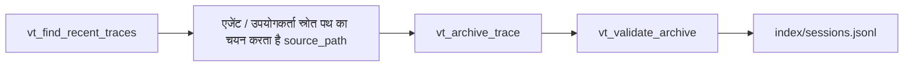

# Vibe Trace

<p align="center">
  
    <a href="https://github.com/Vinay-Umrethe/Vibe-Trace">
    
    
  </a>
</p>

<div align="center",  style="font-size:20px">

🌐 **हिंदी** &nbsp;|&nbsp; [English](README_EN.md)

</div>

**Vibe Trace** वाइब-कोडिंग सेशन के लिए एक लोकल ट्रेस संग्रह और MCP सर्वर है।

यह अलग-अलग प्रोजेक्ट्स, प्लेटफॉर्म्स, प्रोवाइडर्स, मॉडल्स और रीज़निंग क्षमता से आने वाले कोडिंग-एजेंट सेशन्स को एक साफ और व्यवस्थित लोकल ढांचे में रखता है। यह MCP टूल्स भी देता है, ताकि एजेंटिक IDEs (इंटीग्रेटेड डेवलपमेंट एनवायरनमेंट्स) और CLIs (कमांड लाइन इंटरफेसेस) बिना मेहनत के अभिलेखों को ढूंढ, संग्रह, जांच, सूची और देख सकें।

---

## यह क्या संग्रहीत करता है?

**Vibe Trace** दो तरह की लोकल चीजें संग्रहीत करता है:

- `sessions/`: कोडिंग-एजेंट सेशन्स से संग्रह किए गए अभिलेख।
- `index/sessions.jsonl`: संग्रह किए गए अभिलेखों का मेटाडेटा अनुक्रमणिका।

वैकल्पिक:

- `skills/`: यूजर के कार्यप्रवाह में इस्तेमाल होने वाली स्किल्स।

### ढांचा

```plaintext
.vibe-trace/
├── sessions/
│   └── YYYY-MM-DD/
│       └── PROJECT-FULL-NAME/
│           └── S0000--PLATFORM--PROVIDER.MODEL--EFFORT.jsonl
└── index/
    └── sessions.jsonl
```

### अभिलेख का नाम रखने का नियम

पथ:

```plaintext
sessions/YYYY-MM-DD/PROJECT-FULL-NAME/S0000--PLATFORM--PROVIDER.MODEL--EFFORT.jsonl
```

उदाहरण:

```plaintext
sessions/2026-05-10/CHAT-UI/S0000--CODEX--OPENAI.GPT-5.5--LOW-HIGH.jsonl
sessions/2026-05-11/TRAINING-CODE/S0000--CLAUDE-CODE--ANTHROPIC.CLAUDE-4.6-OPUS--HIGH.jsonl
```

फाइल के नाम में चार मुख्य हिस्से हैं:

```plaintext
SESSION--PLATFORM--PROVIDER.MODEL--EFFORT
```

**जिसमें:**

* `--`: मुख्य विभाजक है। सामान्य हैफ़ेन प्रोजेक्ट्स, प्लेटफॉर्म्स, प्रोवाइडर्स, मॉडल्स और रीज़निंग क्षमता के अंदर इस्तेमाल हो सकते हैं।

* `SESSION`: फाइल नाम में गिनती शून्य से शुरू होती है। जैसे `1` बन जाता है `S0000`, `2` बन जाता है `S0001`।

* `EFFORT`: यह एक वैल्यू भी हो सकती है या समय के हिसाब से चलने वाली अनुक्रमणिका भी:

```plaintext
LOW
LOW-HIGH
MEDIUM-HIGH-LOW-XHIGH
```

अनुक्रमणिका में यही मूल्य सूची के रूप में रखी जाती है:

```json
["LOW", "HIGH"]
```

---

## फिर से शुरू किए गए अभिलेख

कुछ प्लेटफॉर्म फिर से शुरू होने की तारीख के लिए नई फाइल बनाने के बजाय नई सूचनाएं को मूल अभिलेख में ही जोड़ सकते हैं। Codex ऐसा करता है: `2026-01-05` को बना अभिलेख `2026-02-15` पर फिर से शुरू होने के बाद भी उसी मूल अभिलेख में नई सूचना जोड़ सकता है।

ऐसे प्लेटफॉर्म के लिए `session_date` में मूल अभिलेख निर्माण तारीख दें। अगर वही प्लेटफॉर्म पथ पहले से मौजूद है, तो **Vibe Trace** अभिलेख को नए स्नैपशॉट के साथ अपडेट करता है और नया SHA-256 हैश की `updates` सूची में रखता है।

इससे उसी असली अभिलेख के लिए एक ही सूचकांक पंक्ति और एक ही अभिलेख पथ रहता है, और नवीनतम हैश के जरिए अखंडता भी बनी रहती है।

> [!TIP]
> सेशन को संग्रह तभी करना बेहतर है जब आपको पक्का आश्वासन हो कि वह पूरा हो चुका है।

### अनुक्रमणिका का रूप

अभिलेख किए गए सेशन `index/sessions.jsonl` संग्रह में अनुक्रमित होते हैं।

उदाहरण:

```json
{
  "status": "archived",
  "platform": "CODEX",
  "provider": "OPENAI",
  "model": "GPT-5.5",
  "project": "APNA_PROJECT",
  "date": "2026-05-11",
  "session": "S0000",
  "reasoning_effort": ["HIGH"],
  "archived_at": "2026-05-10T22:22:21.357891+00:00",
  "source_path": "C:\\Users\\username\\.codex\\sessions\\...",
  "archive_path": "C:\\Users\\username\\.vibe-trace\\APNA_PROJECT\\sessions\\...",
  "sha256": "29d6b12f022a25f1c0e3bb0790361e709c5c66373fce0be023b2f715fc5c6c16",
  "size_bytes": 885582,
  "updates": [
    {
      "status": "updated",
      "updated_at": "2026-05-14T21:49:38.983559+00:00",
      "reasoning_effort": ["HIGH"],
      "sha256": "2d6b06a65802cfe75a1565651539d1cddc6353a8ca94953f3854dd3f859d913c",
      "size_bytes": 1709839
    }
  ]
}
```

ऊपर के fields पहले किए गए अभिलेख स्नैपशॉट के बारे में बताते हैं। आम तौर पर पूरा हो चुके अभिलेख में `updates` **खाली** रहता है। अगर वही अभिलेख बाद में फिर से शुरू होता है तब फिर यह अपडेट हो जाता है। तो बाद के स्नैपशॉट इसमें आते हैं। अगर अपडेट मौजूद हैं, तो जांच में सबसे नया अपडेट हैश इस्तेमाल होता है।

---

## MCP सर्वर

MCP का पूरा नाम Model Context Protocol है। एजेंटिक IDE या CLI MCP क्लाइंट होता है। **Vibe Trace** MCP सर्वर होता है। क्लाइंट वाइब ट्रेस का आरंभ करता है और stdin/stdout के जरिए इसके टूल्स को सक्रिय करता है।

संग्रह बनाने की प्रक्रिया:



`vt_archive_trace` अंतिम अभिलेख लिखने से पहले अंदर से अस्थायी सुरक्षित नकल और SHA-256 जांच पड़ताल करता है। मूल पथ का असली अभिलेख अप्रभावित रहता है।

## MCP टूल्स

### `vt_find_recent_traces`

किसी प्लेटफॉर्म के लिए नए अभिलेखो में से विकल्प ढूंढता है। यह स्वचालित रूप से मिल जाता है। अभी सिर्फ *Cursor, Claude Code, Codex, PI-Agent* को सपोर्ट करता है और सेशन अभिलेखो की खोज करता है।

इनपुट:

```json
{
  "platform": "CODEX", // OR `CLAUDE`, `PI-AGENT`, `CURSOR`.
  "limit": 10,
  "search_roots": null
}
```

`search_roots` सिर्फ तब दें जब डिफ़ॉल्ट अभिलेख पथ गलत हो या पता न हो।

### `vt_archive_trace`

चुनी हुई फ़ाइल को `sessions/` में संग्रह करता है और `index/sessions.jsonl` में उसका अनुक्रमणिका अभिलेख बनाता है या अपडेट करता है।

इनपुट:

```json
{
  "source_path": "C:\\Users\\username\\.codex\\sessions\\...",
  "session_date": "2026-05-11",
  "project": "APNA_PROJECT",
  "session_number": 1,
  "platform": "CODEX",
  "provider": "OPENAI",
  "model": "GPT-5.5",
  "reasoning_effort": ["HIGH"]
}
```

`reasoning_effort` को समय के क्रम के रूप में दें जो अभिलेख में उपयोग किया गया हो, यह उपयोगकर्ता बताता है। उदाहरण: `["HIGH"]` या `["HIGH", "LOW", "XHIGH", "MEDIUM"]`।

### `vt_validate_archive`

संग्रहीत फ़ाइल को नाम रखने के नियम और अनुक्रमणिका के फ़ाइल हैश के खिलाफ जांचता है।

इनपुट:

```json
{
  "path": "C:\\Users\\username\\.vibe-trace\\sessions\\..."
}
```

### `vt_list_sessions`

`index/sessions.jsonl` से संग्रहीत अभिलेखो की सूची देता है।

इनपुट:

```json
{
  "session_date": "2026-05-11",
  "project": "APNA-PROJECT",
  "platform": "CODEX",
  "provider": "OPENAI",
  "model": "GPT-5.5",
  "reasoning_effort": ["HIGH"],
  "limit": 50,
  "offset": 0
}
```

सारे छानने के नियम वैकल्पिक हैं। रिजल्ट्स में पेजिनेशन के लिए `count`, `total_count`, `limit`, `offset`, `has_more`, और `next_offset` भेजता हैं।

### `vt_inspect_file`

`.json`, `.jsonl`, `.parquet`, फ़ाइल या इन्हें रखने वाले फ़ोल्डर के ढांचे का निरीक्षण करता है।

इनपुट:

```json
{
  "path": "C:\\path\\to\\file-or-folder",
  "include_example": true,
  "recursive": true,
  "max_files": 50,
  "max_records_per_file": 1000
}
```

सिर्फ फ़ोल्डर रूट निरीक्षण करना हो तो `recursive: false` दें। निरीक्षण साफ रखने और बहुत बड़े ढांचे ढेर होने से बचाने के लिए `max_files` और `max_records_per_file` दें।

## MCP संसाधन

संसाधन:

```plaintext
vt://readme
vt://convention
vt://sessions/index
```

### इंस्टॉल करना

**Vibe Trace** निर्माण (बिल्ड) के लिए के लिए `uv` और `uv_build` उपयोग करता है।

सोर्स से इंस्टॉल करने के लिए:

```bash
uv pip install -e .
```

बिल्ड करने के लिए:

```bash
uv build
```

बिल्ड व्हील फ़ाइल `dist/` में बनती है।

### चलाइए

```bash
vibe-trace
```

यह लोकल stdio MCP सर्वर स्टार्ट करता है। यह ब्राउज़र नहीं खोलता और किसी पोर्ट पर सुनता नहीं है। इसलिए यह अटका हुआ लग सकता है, लेकिन असल में यह MCP सर्वर लोकली रन कर रहा होता है।

सहायक कमांड:

```bash
vibe-trace --help
vibe-trace --version
vibe-trace status
```

डिफॉल्ट रूप से **Vibe Trace** यह फ़ोल्डर रूट उपयोग करता है:

```plaintext
~/.vibe-trace
```

आप इसे `VIBE_TRACE_ROOT` से बदल सकते हैं:

```bash
VIBE_TRACE_ROOT=/path/to/.vibe-trace vibe-trace
```

## MCP client कॉन्फिग

STDIO उपयोग करें। **Vibe Trace** लोकल MCP सर्वर है, इसलिए API key, OAuth, browser login, या HTTP URL की जरूरत नहीं है।

फॉर्म का उदाहरण:

* `Name`: Vibe Trace
* `Transport`: STDIO
* `Command to launch`: vibe-trace
* `Arguments`: None
* `Environment variables`: None
* `Environment variable passthrough`: None
* `Working directory`: वैकल्पिक

अगर डिफॉल्ट से अलग फ़ोल्डर रूट चाहिए, तो एक एन्वायरमेंट वेरिएबल डाले:

* `Key`=VIBE_TRACE_ROOT
* `Value`=C:\Users\username\somewhere\else\.vibe-trace

डिफॉल्ट फ़ोल्डर रूट पहले से `~/.vibe-trace` है, इसलिए ज्यादातर `VIBE_TRACE_ROOT` तय करने की जरूरत नहीं होती।

सोर्स से चलाने का उदाहरण:

```json
{
  "mcpServers": {
    "vibe_trace": {
      "command": "uv",
      "args": ["run", "python", "-m", "vibe_trace.server"],
      "cwd": "C:\\Users\\username\\Desktop\\APNA_PROJECT"
    }
  }
}
```

इंस्टॉलेशन के बाद चलाने का उदाहरण:

```json
{
  "mcpServers": {
    "vibe_trace": {
      "command": "vibe-trace",
      "args": []
    }
  }
}
```

डेवलपमेंट के दौरान सोर्स से चलाने वाली कॉन्फिग उपयोग करें। `uv build` और व्हील इंस्टॉल करने के बाद इंस्टॉल किए गए पैकेज वाली कॉन्फिग उपयोग करें।

इंस्टॉल किए गए पैकेज वाली कॉन्फिग में, अगर डिफॉल्ट `~/.vibe-trace` फ़ोल्डर रूट सही है तो वर्किंग डायरेक्टरी जरूरी नहीं है। `VIBE_TRACE_ROOT` सिर्फ तब तय करे करें जब अलग फ़ोल्डर रूट चाहिए।

---

## सुरक्षा

**Vibe Trace** लोकल पर्सनल उपयोग के लिए बनाया गया है:

- यह लोकल `~/.vibe-trace/sessions/` फ़ोल्डर में अभिलेख करता है।
- यह ओरिजिनल्स को मूव / डिलीट करने के बजाय सोर्स फाइल्स कॉपी करता है।
- यह SHA-256 से अभिलेख की अखंडता जांचता है।
- यह मेटाडेटा `~/.vibe-trace/index/sessions.jsonl` में स्टोर करता है, जिसमें फिर से शुरू होने वाले अभिलेख के अपडेट्स भी शामिल होते हैं।

इसे सिर्फ विश्वसनीय MCP क्लाइंट्स (IDEs / CLIs / Apps) से कनेक्ट करें, जैसे Cursor, Claude Code, Codex, PI Agent. अभिलेख फ़ाइल में यह सब पाया जा सकता है:

यूज़र प्रॉम्प्ट्स, एजेंट रिस्पॉन्स, जनरेटेड कोड / फाइल्स, कोड में अंतर, लोकल पाथ्स (यूज़रनेम के साथ जैसे `C:\Users\NAME\*`), टूल आउटपुट्स, टोकन यूसेज और प्रोजेक्ट डिटेल्स, और जो भी कोडिंग-प्लेटफॉर्म अपनी फाइल्स में संग्रहीत करता है। आपके संग्रहीत किए गए अभिलेख पूर्ण रूप से आपके हैं।

---

## अनुज्ञप्ति की शर्तें

Vibe-Trace: वाइब-कोडिंग एजेंट ट्रेसेस के लिए एजेंट सेशंस आर्काइव और एमसीपी सर्वर।

Copyright &copy; 2026 विनय उमरेठे <umrethevinay@gmail.com>.

यह प्रोग्राम फ्री सॉफ्टवेयर है: आप इसे फ्री सॉफ्टवेयर फाउंडेशन द्वारा प्रकाशित GNU एफेरो जनरल पब्लिक लाइसेंस की शर्तों के तहत पुनर्वितरित (redistribute) और/या संशोधित (modify) कर सकते हैं, लाइसेंस के वर्जन 3 या आपके विकल्प पर किसी बाद के वर्जन के तहत।

यह प्रोग्राम इस उम्मीद में वितरित किया गया है कि यह उपयोगी होगा, लेकिन बिना किसी वारंटी के; यहां तक कि व्यावसायिकता (merchantability) या किसी खास उद्देश्य के लिए उपयुक्तता (fitness for a particular purpose) की अंतर्निहित वारंटी भी शामिल नहीं है। ज्यादा विवरण के लिए GNU एफेरो जनरल पब्लिक लाइसेंस देखें।

आपको इस प्रोग्राम के साथ GNU एफेरो जनरल पब्लिक लाइसेंस की कॉपी मिलनी चाहिए थी। अगर नहीं मिली, तो देखें <https://www.gnu.org/licenses/>।

**इस प्रोजेक्ट में योगदान देकर, आप अपने योगदान को उसी लाइसेंस के तहत जारी करने के लिए सहमत होते हैं।**

---

## उद्धरण

```bibtex
@misc{vinayumrethe2026vibetrace,
  title = {Vibe-Trace: Agent sessions archive and MCP server for vibe-coding agent traces.},
  author = {Vinay Umrethe},
  year = {2026},
  publisher = {GitHub},
  journal = {GitHub repository},
  howpublished = {\url{https://github.com/Vinay-Umrethe/Vibe-Trace}}
}
```
