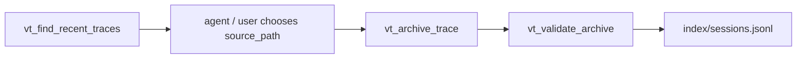

# Vibe Trace

<p align="center">
  
    <a href="https://github.com/Vinay-Umrethe/Vibe-Trace">
    
    
  </a>
</p>

<div align="center",  style="font-size:20px">

🌐 [हिंदी](README.md) &nbsp;|&nbsp; **English**

</div>

**Vibe Trace** is a local trace archive and MCP server for vibe-coding sessions.

It stores coding-agent sessions from different *projects, platforms, providers, models, and reasoning effort levels* in a consistent local structure. It also exposes MCP tools so agentic IDEs and CLIs can *find, archive, validate, list, and inspect* traces without manual work.

---

## What It Stores?

**Vibe Trace** keeps three kinds of local assets:

- `sessions/`: archived trace files from coding-agent sessions.
- `index/sessions.jsonl`: metadata index for archived traces.

Optional:

- `skills/`: workflow skills used by the users.

### Layout

```plaintext
.vibe-trace/
├── sessions/
│   └── YYYY-MM-DD/
│       └── PROJECT-FULL-NAME/
│           └── S0000--PLATFORM--PROVIDER.MODEL--EFFORT.jsonl
└── index/
    └── sessions.jsonl
```

### Session Naming Convention

Path:

```plaintext
sessions/YYYY-MM-DD/PROJECT-FULL-NAME/S0000--PLATFORM--PROVIDER.MODEL--EFFORT.jsonl
```

Examples:

```plaintext
sessions/2026-05-10/CHAT-UI/S0000--CODEX--OPENAI.GPT-5.5--LOW-HIGH.jsonl
sessions/2026-05-11/TRAINING-CODE/S0000--CLAUDE-CODE--ANTHROPIC.CLAUDE-4.6-OPUS--HIGH.jsonl
```

The filename has four structural parts:

```plaintext
SESSION--PLATFORM--PROVIDER.MODEL--EFFORT
```

**Where:**

* `--`: is the structural separator. Normal hyphens stay available inside project names, platforms, model names, and effort sequences.

* `SESSION`: is zero-index in the filename. Like `1` becomes `S0000`, `2` becomes `S0001`.

* `EFFORT`: can be a single value or a chronological sequence:

```plaintext
LOW
LOW-HIGH
MEDIUM-HIGH-LOW-XHIGH
```

In the index, the same value is stored as a list:

```json
["LOW", "HIGH"]
```

---

## Resumed Sessions

Some platforms may append resumed new messages to the original trace file instead of creating a new file for the resume date. Codex does this: a session created on `2026-01-05` can keep receiving new messages when resumed on `2026-02-15`.

For those platforms, use the original trace creation date as `session_date`. If the same archive path already exists, **Vibe Trace** updates that archived file with the newer snapshot and records the new SHA-256 hash under the record's `updates` list.

This keeps one index row and one archive path for the same underlying session while preserving integrity through the latest hash.

> [!TIP]
> It is recommended to *only* archive a session when you are sure its completed.

### Index Format

Archived sessions are indexed in `index/sessions.jsonl`.

Example:

```json
{
  "status": "archived",
  "platform": "CODEX",
  "provider": "OPENAI",
  "model": "GPT-5.5",
  "project": "APNA_PROJECT",
  "date": "2026-05-11",
  "session": "S0000",
  "reasoning_effort": ["HIGH"],
  "archived_at": "2026-05-10T22:22:21.357891+00:00",
  "source_path": "C:\\Users\\username\\.codex\\sessions\\...",
  "archive_path": "C:\\Users\\username\\.vibe-trace\\APNA_PROJECT\\sessions\\...",
  "sha256": "29d6b12f022a25f1c0e3bb0790361e709c5c66373fce0be023b2f715fc5c6c16",
  "size_bytes": 885582,
  "updates": [
    {
      "status": "updated",
      "updated_at": "2026-05-14T21:49:38.983559+00:00",
      "reasoning_effort": ["HIGH"],
      "sha256": "2d6b06a65802cfe75a1565651539d1cddc6353a8ca94953f3854dd3f859d913c",
      "size_bytes": 1709839
    }
  ]
}
```

Top-level fields describe the first archive snapshot. `updates` is **empty** for normal completed sessions and contains later resumed-session snapshots when the same archive is resumed. Validation uses the latest update hash when updates exist.

---

## MCP Server

Model Context Protocol. An agentic IDE or CLI is the MCP client. **Vibe Trace** is the MCP server. The client starts Vibe Trace and calls its tools over stdin/stdout.

The archive flow is:



`vt_archive_trace` internally performs a temporary safe copy and SHA-256 verification before writing the final archive file. The original source trace is left untouched.

## MCP Tools

### `vt_find_recent_traces`

Find recent raw trace candidates for a platform. Automatic discovery currently supports *Cursor, Claude Code, Codex, PI-Agent* only and searches for session files.

Input:

```json
{
  "platform": "CODEX", // OR `CLAUDE`, `PI-AGENT`, `CURSOR`.
  "limit": 10,
  "search_roots": null
}
```

Use `search_roots` only when the default session path is wrong or unknown.

### `vt_archive_trace`

Archive one selected trace into `sessions/` and create or update its record in `index/sessions.jsonl`.

Input:

```json
{
  "source_path": "C:\\Users\\username\\.codex\\sessions\\...",
  "session_date": "2026-05-11",
  "project": "APNA_PROJECT",
  "session_number": 1,
  "platform": "CODEX",
  "provider": "OPENAI",
  "model": "GPT-5.5",
  "reasoning_effort": ["HIGH"]
}
```

Use `reasoning_effort` as the chronological sequence used in the session, (told by user) for example `["HIGH"]` or `["HIGH", "LOW", "XHIGH", "MEDIUM"]`.

### `vt_validate_archive`

Validate an archived trace against the naming convention and index hash.

Input:

```json
{
  "path": "C:\\Users\\username\\.vibe-trace\\sessions\\..."
}
```

### `vt_list_sessions`

List archived sessions from `index/sessions.jsonl`.

Input:

```json
{
  "session_date": "2026-05-11",
  "project": "APNA-PROJECT",
  "platform": "CODEX",
  "provider": "OPENAI",
  "model": "GPT-5.5",
  "reasoning_effort": ["HIGH"],
  "limit": 50,
  "offset": 0
}
```

All filters are optional. Results include `count`, `total_count`, `limit`, `offset`, `has_more`, and `next_offset` for pagination.

### `vt_inspect_file`

Inspect schema structure for `.json`, `.jsonl`, `.parquet`, or a folder containing them.

Input:

```json
{
  "path": "C:\\path\\to\\file-or-folder",
  "include_example": true,
  "recursive": true,
  "max_files": 50,
  "max_records_per_file": 1000
}
```

Use `recursive: false` for only the folder root. Use `max_files` and `max_records_per_file` to keep inspection focused and avoid dumping huge trace structures.

## MCP Resources

Resources:

```plaintext
vt://readme
vt://convention
vt://sessions/index
```

### Install

**Vibe Trace** uses `uv` and `uv_build` for builds.

Install editable:

```bash
uv pip install -e .
```

Build:

```bash
uv build
```

The built wheel is created in `dist/`.

### Run

```bash
vibe-trace
```

This starts a local stdio MCP server. It does not open a browser and does not listen on a port. So it might feel stuck but its running the MCP server locally.

Helper commands:

```bash
vibe-trace --help
vibe-trace --version
vibe-trace status
```

By default, **Vibe Trace** uses this data root:

```plaintext
~/.vibe-trace
```

You can override it with `VIBE_TRACE_ROOT`:

```bash
VIBE_TRACE_ROOT=/path/to/.vibe-trace vibe-trace
```

## MCP Client Config

Use STDIO transport. **Vibe Trace** is a local MCP server, so no API key, OAuth, browser login, or HTTP URL is required.

Example form:

* `Name`: Vibe Trace
* `Transport`: STDIO
* `Command to launch`: vibe-trace
* `Arguments`: None
* `Environment variables`: None
* `Environment variable passthrough`: None
* `Working directory`: Optional

If you want a non-default data root, add one environment variable:

* `Key`=VIBE_TRACE_ROOT
* `Value`=C:\Users\username\somewhere\else\.vibe-trace

The default data root is already `~/.vibe-trace`, so mostly no need to set `VIBE_TRACE_ROOT`.

Source-run config:

```json
{
  "mcpServers": {
    "vibe_trace": {
      "command": "uv",
      "args": ["run", "python", "-m", "vibe_trace.server"],
      "cwd": "C:\\Users\\username\\Desktop\\APNA_PROJECT"
    }
  }
}
```

Installed-package config:

```json
{
  "mcpServers": {
    "vibe_trace": {
      "command": "vibe-trace",
      "args": []
    }
  }
}
```

Use the Source-run config while developing. Use the installed-package config after `uv build` and after installing the wheel.

For installed-package configs, no working directory is required when the default `~/.vibe-trace` data root is correct. Set `VIBE_TRACE_ROOT` only when you want a different data root.

---

## Safety

**Vibe Trace** is designed for local personal use:

- It archives into the local `~/.vibe-trace/sessions/` folder.
- It copies source files instead of moving / deleting originals.
- It validates archive integrity with SHA-256.
- It stores metadata in `~/.vibe-trace/index/sessions.jsonl` including updates if resumed the session.

Only connect it to MCP clients (IDEs / CLIs / Apps) you trust (Like Cursor, Claude Code, Codex, PI Agent). Trace files can contain:

User prompts, Agent responses, Generated code / files, Code diff, Local paths (including username e.g. `C:\Users\NAME\*`), Tool outputs, Token Usage and Project details and anything else the Coding-Platform stores in their session files. You own your sessions.

---

## Licensing Terms

Vibe-Trace: Agent sessions archive and MCP server for vibe-coding agent traces.

Copyright &copy; 2026 Vinay Umrethe <umrethevinay@gmail.com>.

This program is free software: you can redistribute it and/or modify it under the terms of the GNU Affero General Public License as published by the Free Software Foundation, either version 3 of the License, or (at your option) any later version.

This program is distributed in the hope that it will be useful, but WITHOUT ANY WARRANTY; without even the implied warranty of MERCHANTABILITY or FITNESS FOR A PARTICULAR PURPOSE. See the GNU Affero General Public License for more details.

You should have received a copy of the GNU Affero General Public License along with this program. If not, see <https://www.gnu.org/licenses/>.

**By contributing to this project, you agree to release your contributions under the same license.**

---

## Citation

```bibtex
@misc{vinayumrethe2026vibetrace,
  title = {Vibe-Trace: Agent sessions archive and MCP server for vibe-coding agent traces.},
  author = {Vinay Umrethe},
  year = {2026},
  publisher = {GitHub},
  journal = {GitHub repository},
  howpublished = {\url{https://github.com/Vinay-Umrethe/Vibe-Trace}}
}
```
